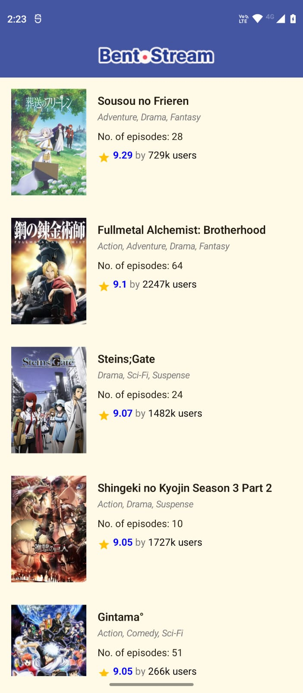
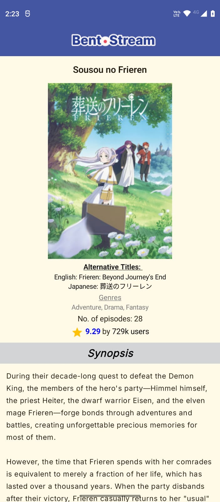
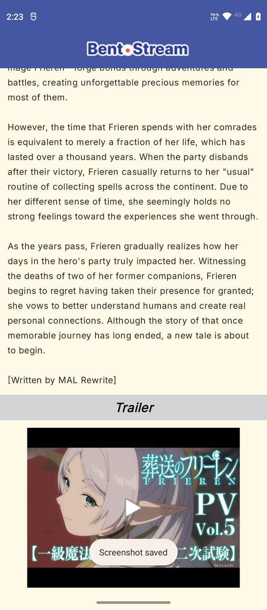

# BentoStream

BentoStream is an Android app that allows users to browse popular anime series, view detailed information, watch trailers, and explore genres. The app is built using **Kotlin**, **Jetpack Compose**, and integrates with the **Jikan API** for anime data.

---

## 📱 App Demo

<p align="center">
  
</p>

## Features

- **Home Page:** Browse a list of popular anime with thumbnails and scores.
- **Anime Details:** View detailed information about an anime, including synopsis, episodes, score, and trailer.
- **Trailer Playback:** Clickable trailer thumbnails open YouTube links.
- **Responsive UI:** Built entirely with Jetpack Compose.
- **Dark Mode Support:** Automatic theme switching based on system settings.
- **Google Fonts:** App uses the Inter font family for a clean, modern look.
- **Material3 Design:** Consistent Material3 styling across the app.
- **Offline Mode (planned):** Local caching with Room DB for offline browsing and syncing when online.

---

## Screenshots

### ➤ Home Page


### ➤ Details Page (Anime Details + Synopsis)


### ➤ Trailer Section


---

## Installation

1. Clone the repository:

```bash
git clone https://github.com/yourusername/bentostream.git
